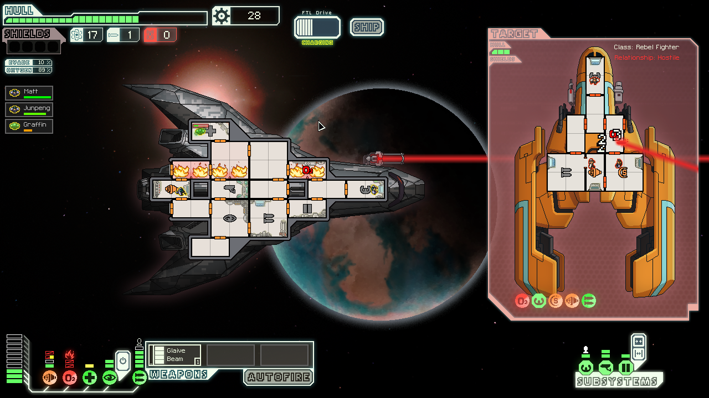
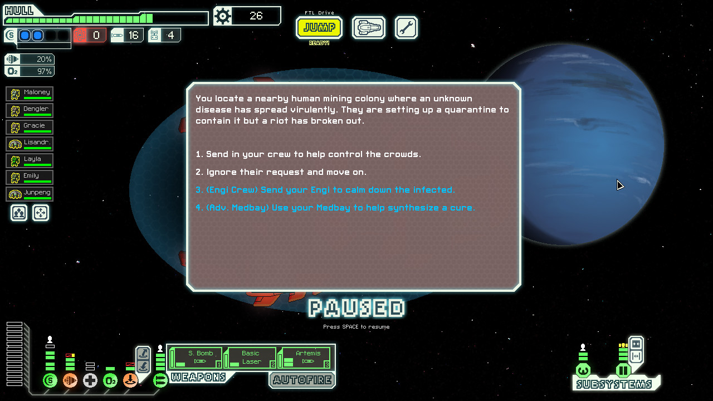
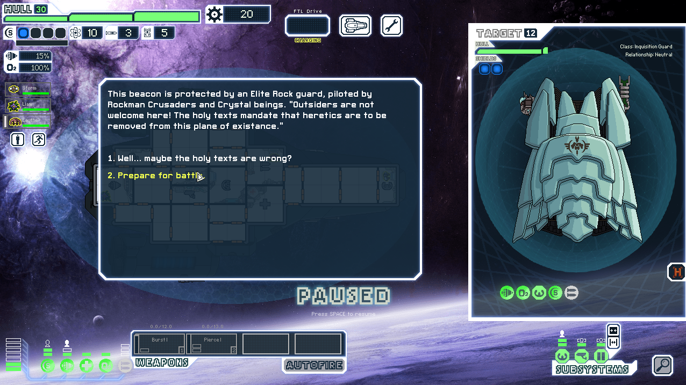

I love FTL: Faster Than Light
I ramble about a game I like for too long
29/01/2022 23:23
faster-than-light, gaming, indie-games
-----
This blog post was written to be the content of a page for one of my university modules where we were required to write about something we were interested in, and unlikely to be picked by anybody else. I've decided to stick it up here too, because why not?  
I had originally intended for this to be a list of some of my favourite indie games, but it quickly spiralled into just being about FTL. (Still might do that list later though)

## FTL: Faster Than Light

*Genre: indie, rogue-like, strategy*

FTL was a first in several ways for me. It was my first PC game (Now the only platform I play on), my first indie game (Now the vast majority of games that I play), and the first game I ever chose to buy myself, instead of having it bought for me. As a result, it's probably not possible for me to talk about it without looking through rose-tinted glasses to some extent, so take my opinion with a grain of salt.

You play as the captain of a ship, belonging to the federation. You must manage your crew and energy usage and make decisions on how to survive throughout your journey and help defend the federation against the rebels.

FTL is a "rougelike" game, meaning on each playthrough you start from scratch. Weak and with little to defend yourself, you must upgrade your ship and take on new crewmembers to hope to survive the many dangers you find as you explore the universe. With a wide range of weapons, from laser machine guns that take time to start up but are deadly once unleashed, to fire beams to kill your enemy ship's crew while leaving their ship (mostly) intact, and systems like hacking to take over a ship's navigation or teleporters to form boarding crews, there are many ways to play the game. Unfortunately for you, enemy ships also have access to the same arsenal of systems, and they aren't willing to go down without a fight.

The game also has an [amazing soundtrack](https://benprunty.bandcamp.com/album/ftl) (+[advanced edition soundtrack](https://benprunty.bandcamp.com/album/ftl-advanced-edition-soundtrack)) by Ben Prunty, which perfectly fits the atmosphere of the game. It really wouldn't be the same without this great music.

To make each run more different, the game also has unlockable ships (8 ships with 3 variants, and 2 more hidden ships with 2 variants each, for a total of a lot of ships), offering several different playstyles and extra challenges.

### Choices

*Extra options you have access to are highlighted in blue*

Another one of my favourite things about FTL is the choices it gives you. As an example:

*"You arrive at the distress beacon near a small asteroid belt and find a ship with pirate markings partially crushed between two large rocks. It must have been illegally mining the belt without proper equipment."*  
Your choices to respond to this are:  
*"Try to dislodge the pirates by shooting at the rocks."* - Will you damage their ship by doing this? What if they think you're trying to attack them, or since they're pirates, decide to attack you anyway? However, they may also reward you for your assistance.  
*"Destroy and loot the ship. They're just pirates."* - You might get some scrap (The game's currency) from destroying them, but what if they have friends around that see you?  
However, if you have a beam weapon or beam drone, you can *"(Beam Weapon) Carefully cut the ship out."* - Guaranteed to work, and you'll get your scrap reward, however it requires having specific equipment on your ship.

This is just one single simple event that you can come across in your exploration, and even it has complexity in its choices. There never is a perfect choice, and you can only guess at what the outcome of your actions will be.

The game costs £7, and [regularly goes on sale](https://steamdb.info/app/212680/) for the incredibly low price of £1.74 - well worth the hundreds of hours of fun I've gotten from this game (Note: At the time of writing, it is 75% off on steam!). As a warning though - FTL is hard. You'll die. A lot. Easy mode is a must when starting out, and I'm still not convinced hard mode is actually beatable.  
[Steam](https://store.steampowered.com/app/212680/FTL_Faster_Than_Light/)  
[GOG](https://www.gog.com/game/faster_than_light) (Although the Steam version is also DRM free)  
[Humble](https://www.humblebundle.com/store/ftl-faster-than-light)  
And even [iPad](https://apps.apple.com/us/app/ftl-faster-than-light/id833951143), although if you buy it here you'll miss out on what I'm next to talk about...

## FTL: Multiverse

Finally, the game has some amazing mods, particularly [FTL: Multiverse](https://www.subsetgames.com/forum/viewtopic.php?t=35332). (The base game is good enough that I put over 100 hours into the vanilla game before looking at mods, but I recommend you try some out eventually). It essentially acts as a sequel, building significantly on the vanilla game - everything from significantly expanding the base game's atmospheric world building, to completely overhauling many mechanics of the base game and adding a ***lot*** of new content, and [20 new great music tracks](https://www.youtube.com/playlist?list=PLXARrpodicQsHXiZoecojFMsoXvrTN1Hv) to the vanilla's already stellar soundtrack. It essentially overhauls, expands, or refurbishes nearly every aspect of the game, whether it's ships, crew, events, weapons, etc. while still feeling balanced, and retaining what made the original game so great.

The mod released in 2019, 7 years after the game released, and is still under active development, being on version 5.0 at the time of writing, with 5.1 set to release a few weeks from now, bringing a new mechanic, questline and sector. Multiverse is seriously one of my favourite mods I have ever played, and I love it.

### Conclusion: What was this blog post?

Very rambly. Next blog post will probably be on something completely different, possibly how I'm making this blog? Probably equally rambly though.
